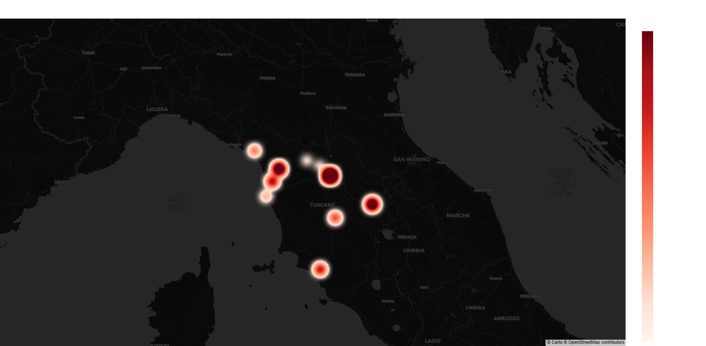

# 🏡 PropTech Intelligence: Real Estate Arbitrage Engine (V3)

## 🎯 The Mission

In a fragmented real estate market like Tuscany, identifying true investment opportunities requires crossing multiple data streams. This project evolved from a simple anomaly detector into a full **End-to-End Arbitrage Engine**. It identifies undervalued properties to be renovated ("Flipping"), calculates the estimated renovation costs (CAPEX), and crosses the data with the Hyper-Local Premium Market to calculate the net Potential ROI — now with stricter sanity checks, automated visual reporting, and daily case-study generation.

## 🏗️ The Architecture

1. **Extraction (Browser Automation):** Collects publicly listed real estate data via a resilient browser-automation pipeline, segregating the market into two distinct Data Marts: Flipping (Ruins) vs Premium (Class A/B). Includes automatic local Chrome version detection (Windows registry lookup) to keep the driver aligned with the installed browser.

2. **Geo-Enrichment:** Uses thread-pools (Concurrency) to interrogate internal APIs and extract the exact GeoID micro-zone for each property, with per-worker fault isolation so a single failed request never crashes the batch.

3. **Financial Engine (Pandas):**

   - Establishes a localized Fair Market Value from the Premium market median per GeoID.

   - Applies strict Sanity Checks: minimum zone density (≥2 comparable listings), minimum area (≥40 m²), a realistic premium price ceiling (€12,000/m²), and a **zero-tolerance deviation filter** — a flipping candidate is only accepted if it's priced at or below the local median of comparable unrenovated listings.

   - Calculates the **Equity Gap** (Potential Profit) and **ROI %**, factoring in standard renovation costs per square meter.

   - When no listing clears the strict "Gold Mine" bar, the engine automatically falls back to surfacing the top 3 **Near-Miss / Best Available** candidates, clearly labeled as such (never mislabeled as a confirmed deal).

4. **Visual Reporting Engine:** Auto-generates a daily set of PNG charts (top opportunities by profit, price-vs-area scatter, deviation distribution histogram) summarizing the day's findings — separate outputs for confirmed arbitrage vs. near-miss runs.

5. **Case Study Generator:** Produces a daily Markdown report detailing the top opportunities (zone density, listing price, comparable median, renovation cost, total investment, estimated resale value, net profit and ROI %) for quick human review.

6. **Delivery:** Dispatches real-time alerts for confirmed "Gold Mines" (Profit ≥ configurable threshold, default €40k) directly to a secure Telegram Bot, filtering out non-comparable listings (nuda proprietà, usufrutto, box, garage, aste).

## 📊 Market Discovery: The "Oltrarno" Case Study

The algorithm successfully identified an independent property in Florence (Oltrarno) priced at €3,065/sqm. By crossing this with the local Premium Median of €9,631/sqm, the model validated a massive potential equity gap, proving the existence of structural market inefficiencies.



*Figure 1: Geospatial Heatmap identifying the concentration of highest Potential Profit across Tuscany, generated by the companion `profit_heatmap.py` script from the same GeoID-enriched data marts.*

## 🖥️ Usage

The script exposes an interactive CLI menu, or accepts a direct command as an argument:

```bash
python alpha_tuscany_profit.py scrape_flipping   # Scan "to renovate" listings (last 48h)
python alpha_tuscany_profit.py scrape_premium    # Scan baseline premium listings (last 48h)
python alpha_tuscany_profit.py run_arbitrage     # Run the financial arbitrage analysis
```

Configuration (Telegram credentials, renovation cost/m², minimum profit target) is managed via a `.env` file.

## 🛠️ Tech Stack

- **Language:** Python

- **Data Engineering:** Pandas, CSV-based data marts, ETL Pipelines, structured logging

- **Automation & Scraping:** Browser automation (Selenium-based), Concurrent Futures (ThreadPoolExecutor), Regex

- **Security & Ops:** Environment Variables (.env), Robust Error Handling (Fault Tolerance), Windows Chrome-version auto-detection

- **Reporting:** Matplotlib (automated chart generation), Markdown case-study reports

- **Geospatial Analytics:** Plotly

- **Notifications:** Telegram Bot API
